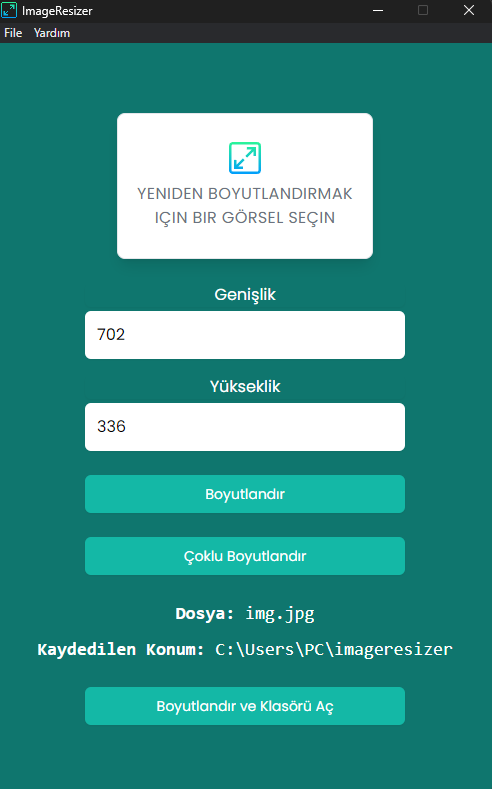

# Image Resizer

Electron application that allows you to select an image and easily change the width and/or height.
Constant resolutions are 2000x1600, 974x360, 928x340 ve 600x477.
It gives output by converting PNG, JPG, JPEG image formats to WEBP format.

<div style="display: flex; justify-content: center">

</div>

## Notes

Electron 22.0.0 version was chosen so that the application could run on Windows 8 and, higher.

## Usage

Install dependencies:

```bash

npm install
```

Run:

```bash
npm start
```

You can also use `Electronmon` to constantly run and not have to reload after making changes

```bash
npx electronmon .
```

## Developer Mode

If your `NODE_ENV` is set to `development` then you will have the dev tools enabled and available in the menu bar. It will also open them by default.

When set to `production`, the dev tools will not be available.

## Package
If you want to run the application with exe, enter the following code in the terminal.

```bash
electron-packager . ImageResizer --overwrite --asar --platform=win32 --arch=ia32 --icon=assets/icons/win/icon.ico --prune=true --out=./release --version-string.CompanyName=CE --version-string.FileDescription=CE --version-string.ProductName="ImageResizer"
```